# DARE-Net: Diagnosis-Aware Routing Mixture-of-Experts for Accurate and Clinically Interpretable Brain Age Estimation

[](https://opensource.org/licenses/MIT)
[](https://www.python.org/downloads/)
[](https://pytorch.org/)

Official PyTorch implementation of **"DARE-Net: Diagnosis-Aware Routing Mixture-of-Experts for Accurate and Clinically Interpretable Brain Age Estimation"**, *Medical Image Analysis*, 2026.


## 📋 Table of Contents

- [Abstract](#abstract)
- [Highlights](#highlights)
- [Model Architecture](#model-architecture)
- [Key Features](#key-features)
- [Results](#results)
- [Installation](#installation)
- [Quick Start](#quick-start)
- [Data Preparation](#data-preparation)
- [Training](#training)
- [Evaluation](#evaluation)
- [Citation](#citation)
- [License](#license)

## Abstract

Brain age estimated from structural MRI is an interpretable marker of neurobiological aging. However, clinical deployment is challenged by diagnosis-dependent heterogeneity across the cognitively normal (CN), mild cognitive impairment (MCI), and Alzheimer's disease (AD) spectrum, and by age-dependent bias in the brain-age gap (BAG). 

We introduce **DARE-Net**, a multi-task mixture-of-experts that jointly stages dementia and predicts brain age. DARE-Net routes each subject to a sparse set of age experts using the model's predicted diagnosis posterior, enabling trajectory-specific regression without requiring diagnosis labels at inference. To make this self-conditioned routing trainable, we propose scheduled teacher forcing that gradually transitions the routing signal from ground-truth labels to predicted posteriors, mitigating early expert collapse. We further incorporate ordinal-aware ranking regularization, heteroscedastic regression for calibrated uncertainty, and age-binned BAG standardization (BAGZ) for bias-reduced interpretation.

**On ADNI, DARE-Net achieves 1.14-year mean absolute error (MAE; 0.89 in CN) and 96.88% three-way staging accuracy with no CN↔AD confusions.**

## Highlights

- ✅ **Diagnosis-aware sparse routing** selects age experts using predicted CN/MCI/AD posteriors, avoiding inference-time labels
- ✅ **Scheduled teacher forcing** stabilizes self-conditioned routing and prevents early expert collapse  
- ✅ **ADNI: 1.14-year MAE** and **96.88% staging accuracy** with zero CN ↔ AD confusions
- ✅ **Uncertainty modeling and BAGZ** reduce bias and improve calibration/robustness across age and sex subgroups

## Model Architecture

DARE-Net uses the **ACDense backbone** (Asymmetric Convolution with Dense connections) with Diagnosis-Aware Routing MoE:

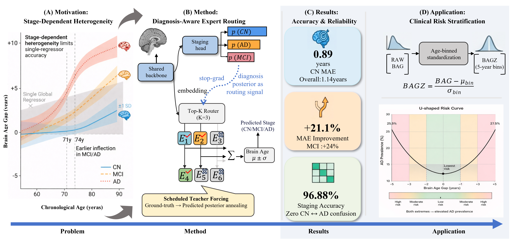

*Figure 1: DARE-Net architecture overview. The model processes MRI scans and sex information through a shared ACDense backbone, then routes to age experts based on predicted diagnosis posteriors (CN/MCI/AD).*

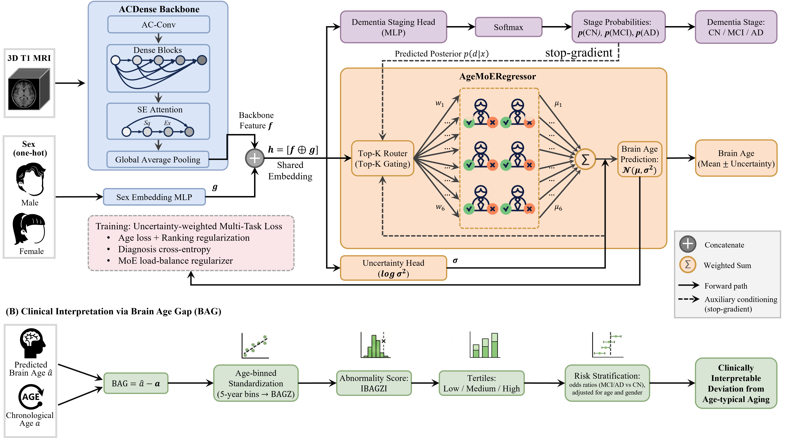

*Figure 2: Modular brain age model pipeline with diagnosis-aware routing. The model does not require diagnosis labels at inference time.*

### Key Components

1. **ACDense Backbone**: Asymmetric Convolution layers (3×3×3, 1×1×3, 3×1×1, 1×3×1) with Dense connections and SE attention for efficient 3D feature extraction
2. **Multi-Task Learning**: Joint brain age estimation + dementia staging (3-class: CN/MCI/AD)
3. **Diagnosis-Aware Routing MoE**: Top-K sparse routing (K=3) among 8 age experts, guided by predicted diagnosis posteriors
4. **Scheduled Teacher Forcing**: Gradual transition from ground-truth labels to predicted posteriors during training
5. **Heteroscedastic Regression**: Calibrated uncertainty estimation (predicts μ ± σ)
6. **Ordinal-Aware Ranking Loss**: Preserves age ordering relationships across samples

## Key Features

### 1. Diagnosis-Aware Routing

DARE-Net routes each subject to a sparse set of age experts using the model's own predicted diagnosis posterior, enabling trajectory-specific regression without requiring diagnosis labels at inference. The routing mechanism uses Top-K selection (K=3) from 8 experts, where the gating network is conditioned on predicted CN/MCI/AD probabilities.

**Key Innovation**: No diagnosis labels required at inference time - the model uses its own staging predictions to route samples.

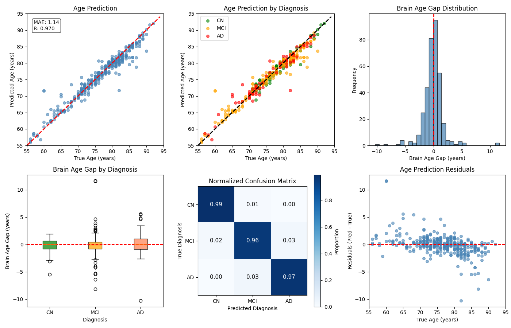

*Figure 3: Stage-dependent heterogeneity across CN/MCI/AD spectrum. DARE-Net addresses this by routing samples to specialized experts.*

### 2. Scheduled Teacher Forcing

To stabilize self-conditioned routing, we propose scheduled teacher forcing that gradually transitions from ground-truth labels to predicted posteriors over training epochs:

```
α(t) = 1 - (epoch / tf_epochs)  for epoch < tf_epochs
     = 0                         for epoch >= tf_epochs

routing_signal = α(t) × one_hot(true_label) + (1 - α(t)) × predicted_posterior
```

This prevents early expert collapse and ensures stable training.

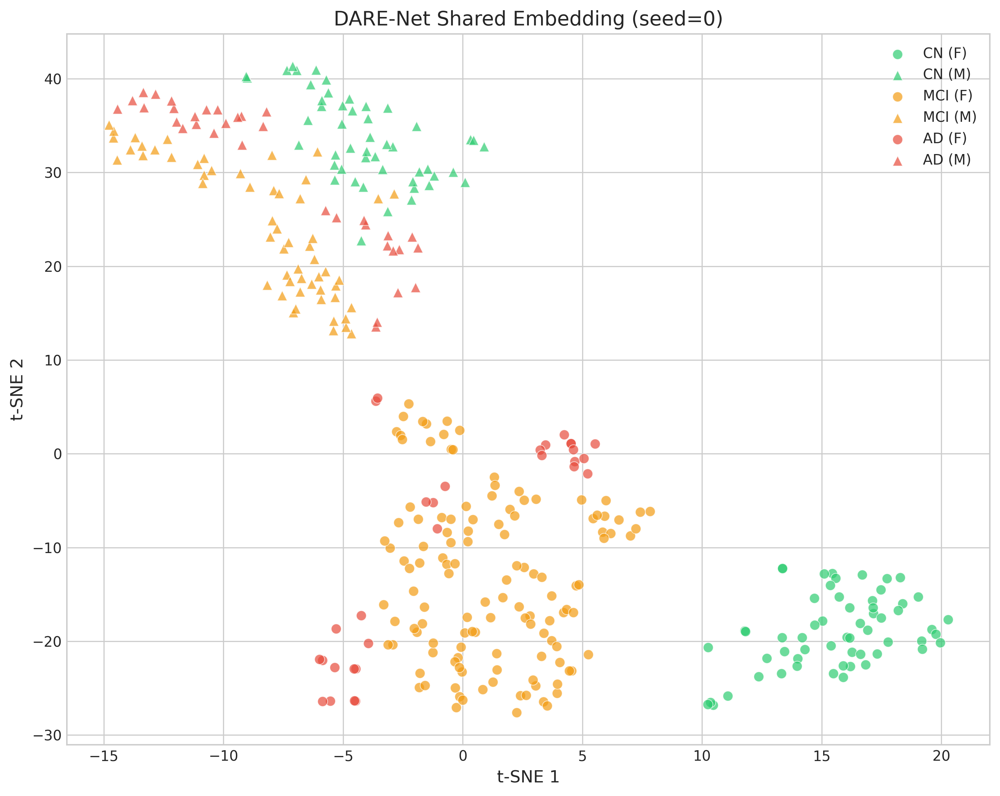

*Figure 4a: Scheduled teacher forcing strategy. The routing signal gradually transitions from true labels (y) to predicted posteriors (p̂) over training epochs.*

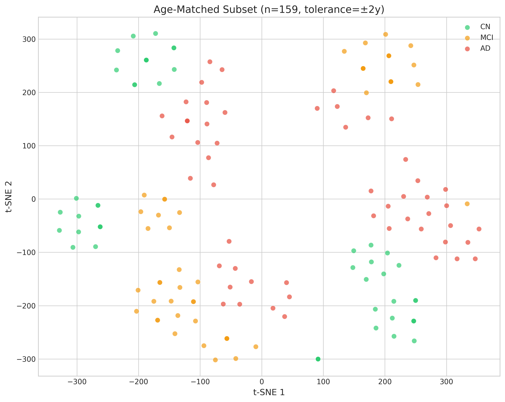

*Figure 4b: Clinical interpretation pipeline. BAG is standardized into BAGZ using age-binned standardization (5-year bins), enabling risk stratification.*

### 3. Clinical Interpretation

DARE-Net provides clinically interpretable outputs through Brain Age Gap Z-score (BAGZ) standardization:

- **BAG** = Predicted Brain Age - Chronological Age
- **BAGZ** = Age-binned standardization (5-year bins) → `(BAG - μ_bin) / σ_bin`
- **Risk Stratification**: |BAGZ| > threshold indicates deviation from age-typical aging

## Results

### Performance on ADNI Dataset

| Metric | DARE-Net | Improvement |
|--------|----------|-------------|
| **MAE (All)** | **1.14 years** | - |
| **MAE (CN)** | **0.89 years** | Best |
| **MAE (MCI)** | 1.18 years | +24% vs baseline |
| **Staging Accuracy** | **96.88%** | - |
| **CN↔AD Confusions** | **0** | Zero errors |

### Comprehensive Evaluation Results

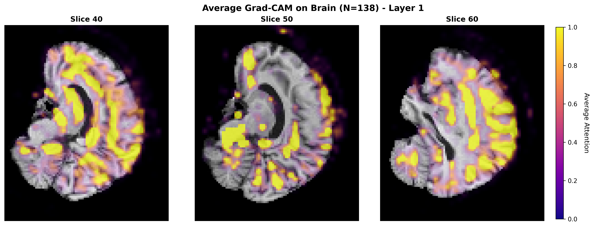
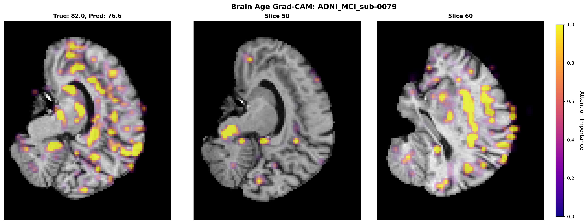
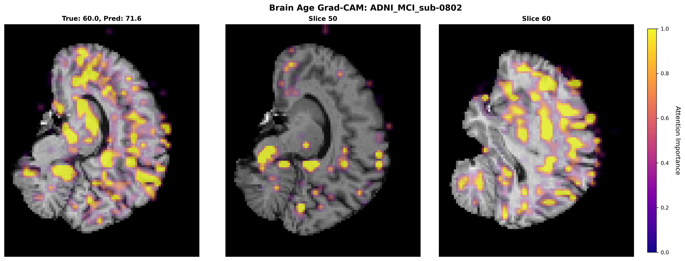
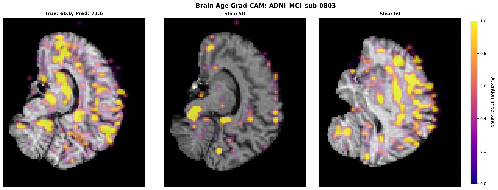

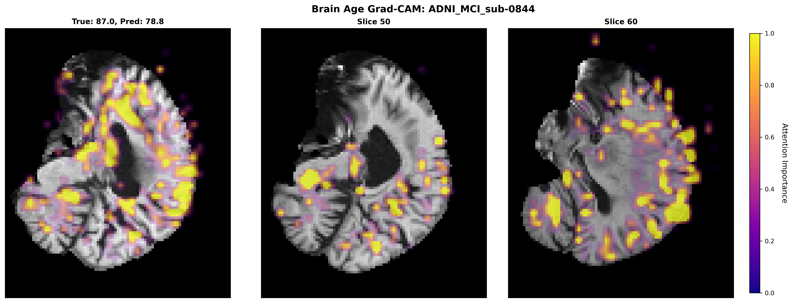

*Figure 5: Comprehensive evaluation results. (a) Age prediction scatter plot (MAE=1.14, R=0.970). (b) Age prediction by diagnosis. (c) Brain age gap distribution. (d) BAG by diagnosis (box plot). (e) Normalized confusion matrix (96.88% accuracy). (f) Age prediction residuals.*

### Comparison with Baselines

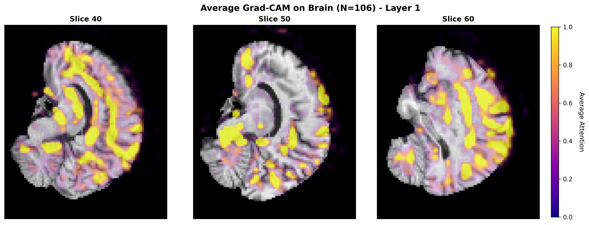

*Figure 6a: MAE comparison across age bins. DARE-Net (Ours) achieves consistently low MAE across all age groups, especially in the 60-80 age bin (1.0 years).*

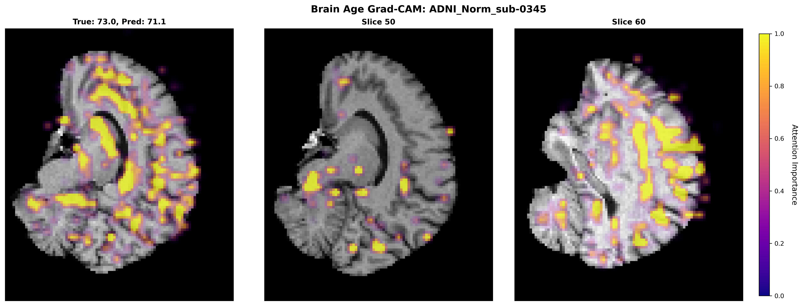

*Figure 6b: Gender subgroup MAE comparison. DARE-Net shows balanced performance across gender subgroups (lower-left is better).*

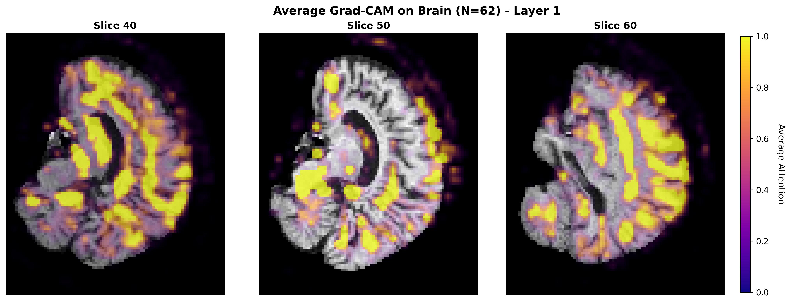

*Figure 6c: Prediction Interval Coverage Probability (PICP) for uncertainty calibration. DARE-Net shows well-calibrated uncertainty estimates.*


*Figure 6d: Brain Age Gap (BAG) analysis showing U-shaped risk curve. Both extremes (positive and negative BAG) indicate elevated AD prevalence.*

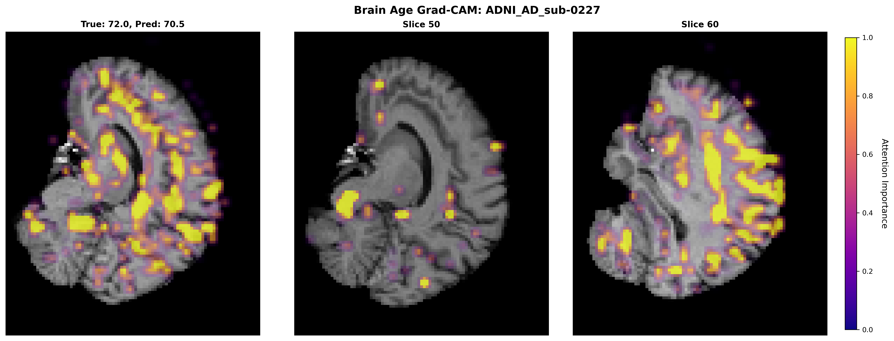

*Figure 6e: Odds ratios for MCI/AD vs CN across BAG groups, adjusted for age and gender.*

### Visualization Results

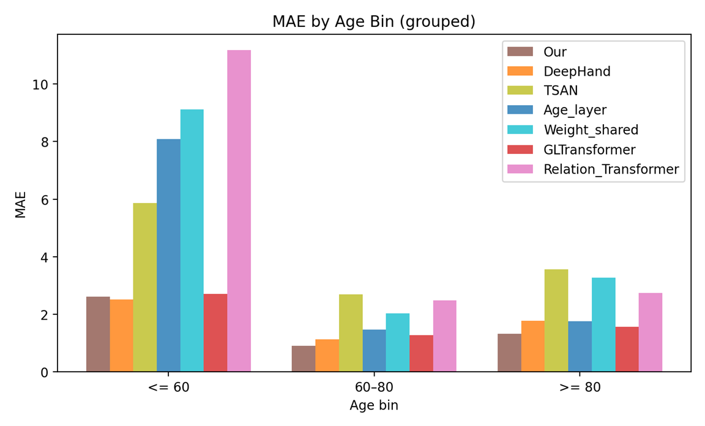

*Figure 7a: t-SNE visualization of DARE-Net shared embedding space. The model learns discriminative features that separate CN, MCI, and AD groups.*

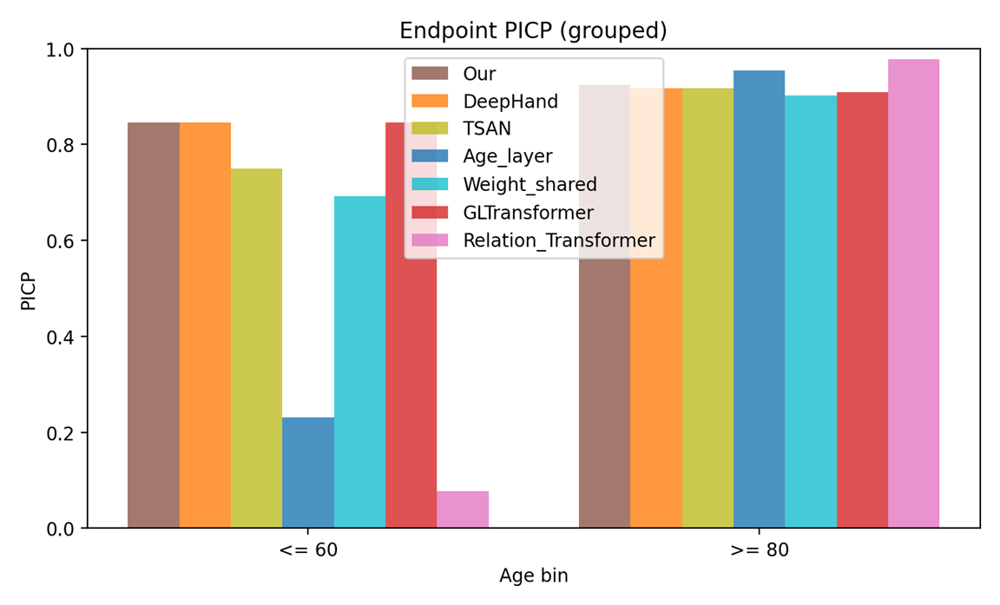

*Figure 7b: Average Grad-CAM attention maps (N=138). The model focuses on cortical regions, particularly frontal and parietal lobes, for brain age prediction.*

### Clinical Application


*Figure 8: Brain Age Gap trajectories across CN/MCI/AD groups with chronological age. Shows different aging trajectories and turning points for each diagnostic group.*

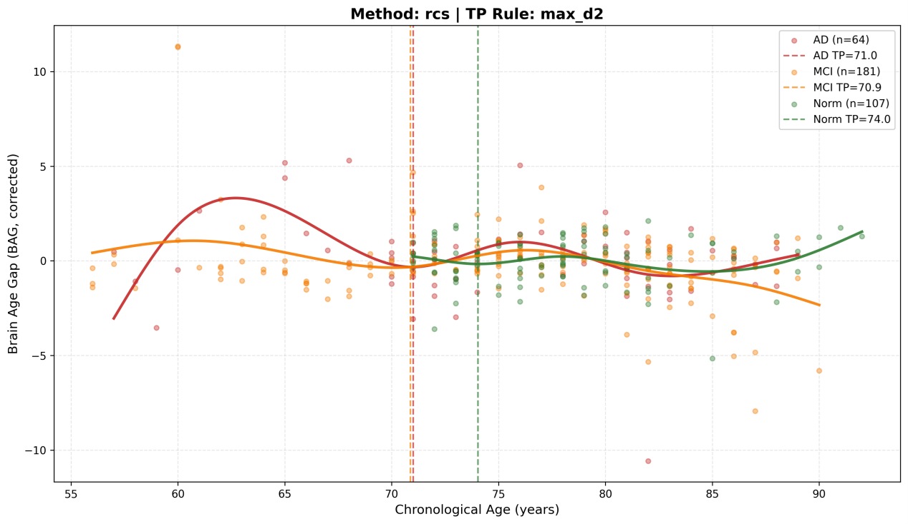

*Figure 9: t-SNE visualization colored by Brain Age Gap. Shows the relationship between embedding space and brain age deviation.*

### Detailed Evaluation Metrics

- **Age Prediction**: MAE = 1.14 years, Pearson R = 0.970, RMSE = 1.52 years
- **Dementia Staging**: 
  - CN Precision: 99.0%, Recall: 99.0%
  - MCI Precision: 96.0%, Recall: 96.0%
  - AD Precision: 97.0%, Recall: 97.0%
- **Zero CN↔AD confusions**: Perfect separation between cognitively normal and Alzheimer's disease

### Robustness Analysis

- **Age Extremes**: Consistent performance across ≤60, 60-80, and ≥80 age bins
- **Gender Subgroups**: Balanced MAE across male/female subgroups (1.0 vs 1.3 years)
- **Uncertainty Calibration**: Well-calibrated prediction intervals (PICP ≈ 0.84-0.92)

## Installation

### Requirements

- Python >= 3.8
- PyTorch >= 1.7
- CUDA (recommended for GPU training)
- See `requirements.txt` for full dependencies

### Install Dependencies

```bash
# Clone the repository
git clone https://github.com/AlphaWuSeu/DARE-Net.git
cd DARE-Net

# Install dependencies
pip install -r requirements.txt
```

## Quick Start

### 1. Prepare Your Data

Organize your data in the following structure:

```
data/
├── train/
│   ├── sub-0001.nii.gz
│   ├── sub-0002.nii.gz
│   └── ...
├── val/
│   ├── sub-0003.nii.gz
│   └── ...
├── test/
│   ├── sub-0005.nii.gz
│   └── ...
└── Dataset.csv
```

### 2. Configure Dataset Paths

Edit `Best/hyperparameter.json` or modify paths in `script/bash_train_darenet.sh`:

```bash
# Update these paths in bash_train_darenet.sh
label=/path/to/Dataset.csv
train_data=/path/to/train
valid_data=/path/to/val
test_data=/path/to/test
```

### 3. Train DARE-Net

```bash
bash script/bash_train_darenet.sh
```

## Data Preparation

### Dataset.csv Format

The CSV file should contain the following columns:

| ID | age | sex | dx |
|----|-----|-----|----|
| sub-0001.nii.gz | 72 | M | 0 |
| sub-0002.nii.gz | 68 | F | 1 |
| sub-0003.nii.gz | 75 | M | 2 |

**Column Descriptions:**
- `ID`: Filename of the MRI scan (must match files in train/val/test folders)
- `age`: Chronological age (integer)
- `sex`: Gender (M/F or 0/1, where 0=Female, 1=Male)
- `dx`: Diagnosis label (0=CN, 1=MCI, 2=AD)

### Data Preprocessing

All MRIs should be preprocessed using a standard pipeline:

1. **Nonlinear registration** to MNI space (using FSL)
2. **Brain extraction** (using FSL BET or similar)
3. **Final voxel size**: 91 × 109 × 91 with 2mm³ isotropic resolution

## Training

### Train with Best Hyperparameters

```bash
bash script/bash_train_darenet.sh
```

The script will:
1. Load hyperparameters from `Best/hyperparameter.json`
2. Train DARE-Net with optimal settings
3. Save checkpoints to `output/DARENet_best/`
4. Automatically evaluate on test set

### Key Hyperparameters

| Parameter | Description | Default | Range |
|-----------|-------------|---------|-------|
| `moe_num_experts` | Number of age experts | 8 | 4-12 |
| `moe_topk` | Top-K routing | 3 | 2-4 |
| `moe_tf_epochs` | Scheduled teacher forcing epochs | 16 | 10-20 |
| `moe_use_dx` | Diagnosis-aware routing | true | true/false |
| `moe_gate_temp` | Gating temperature | 1.5 | 0.8-2.0 |
| `moe_alpha` | Load balance weight | 0.02 | 0.01-0.05 |
| `age_hetero` | Heteroscedastic regression | true | true/false |
| `pairwise_w` | Ordinal-aware ranking weight | 0.23 | 0.0-0.5 |
| `batch_size` | Training batch size | 4 | 2-8 |
| `lr` | Learning rate | 9.16e-4 | 1e-5 to 1e-3 |
| `epochs` | Training epochs | 100 | 50-150 |

### Customize Training

Edit `Best/hyperparameter.json` to customize hyperparameters:

```json
{
    "model": "DARENet",
    "batch_size": 4,
    "epochs": 100,
    "lr": 0.0009156219996824213,
    "moe_num_experts": 8,
    "moe_topk": 3,
    "moe_use_dx": true,
    "age_hetero": true,
    "pairwise_w": 0.23,
    ...
}
```

## Evaluation

### Test Trained Model

After training, the model automatically evaluates on the test set and saves results to:

- `output/DARENet_best/metrics_epoch.csv` - Per-epoch metrics
- `output/DARENet_best/metrics.json` - Final test metrics
- `output/DARENet_best/mtl_test_results.csv` - Detailed predictions
- `output/DARENet_best/mtl_evaluation_plots.png` - Visualization plots

### Load Pre-trained Model

The best pre-trained model is available at: `Best/DARENet_best_model.pth.tar`

```python
import torch
from darenet.model import ACDense
from darenet.utils.config import opt

# Load model
checkpoint = torch.load('Best/DARENet_best_model.pth.tar', weights_only=False)
model = ACDense.DARENet(8, 5, use_gender=True, num_classes=3, opt=opt)
model.load_state_dict(checkpoint['state_dict'])
model.eval()

# Inference
age_pred, dx_logits = model(mri_tensor, gender_tensor)
dx_probs = torch.softmax(dx_logits, dim=1)
```

## Project Structure

```
DARE-Net/
├── darenet/                    # Main source code
│   ├── model/
│   │   ├── ACDense.py         # ACDense backbone & DARENet model
│   │   ├── ranking_loss.py   # Ranking loss functions
│   │   └── sodeep.py          # SoDeep sorter
│   ├── utils/
│   │   ├── config.py          # Configuration parser
│   │   └── lr_scheduler.py   # Learning rate schedulers
│   ├── train_first_stage.py   # Training script
│   ├── prediction_first_stage_mtl.py  # Evaluation script
│   └── load_data.py           # Data loading utilities
├── Best/                       # Best hyperparameters & model
│   ├── hyperparameter.json    # Optimal hyperparameters
│   └── DARENet_best_model.pth.tar  # Pre-trained model
├── script/
│   └── bash_train_darenet.sh  # Training script
├── imgs/                       # Figures and diagrams
├── requirements.txt            # Python dependencies
└── README.md                   # This file
```

## Citation

If you find this work useful, please cite:

```bibtex
@article{wu2026darenet,
  title={DARE-Net: Diagnosis-Aware Routing Mixture-of-Experts for Accurate and Clinically Interpretable Brain Age Estimation},
  author={Wu, Fuzhi and Ding, Shan and Zhu, Hao and Gao, Yue and Kong, Youyong and Wu, Jiasong and Shu, Huazhong and Wu, Shuangshuang and Duan, Yu},
  journal={Medical Image Analysis},
  year={2026},
  publisher={Elsevier}
}
```

## Related Work

This work builds upon:

- Cheng et al., "Brain Age Estimation From MRI Using Cascade Networks with Ranking Loss", *IEEE Transactions on Medical Imaging*, 2021. [Paper](https://doi.org/10.1109/TMI.2021.3085948)

## License

This project is licensed under the MIT License - see the [LICENSE](LICENSE) file for details.

## Contact

For questions, please open an issue on GitHub or contact:

- **Jiasong Wu** (Corresponding Author): jiasong.wu@seu.edu.cn
- **Project Page**: https://github.com/AlphaWuSeu/DARE-Net

## Acknowledgments

We thank the ADNI and OASIS datasets for providing the data used in this study.

---

**Note**: This is the official implementation of DARE-Net. For reproducibility, please use the exact hyperparameters provided in `Best/hyperparameter.json`.
